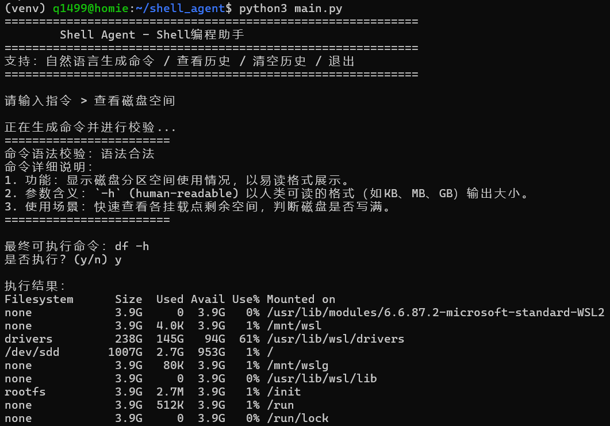
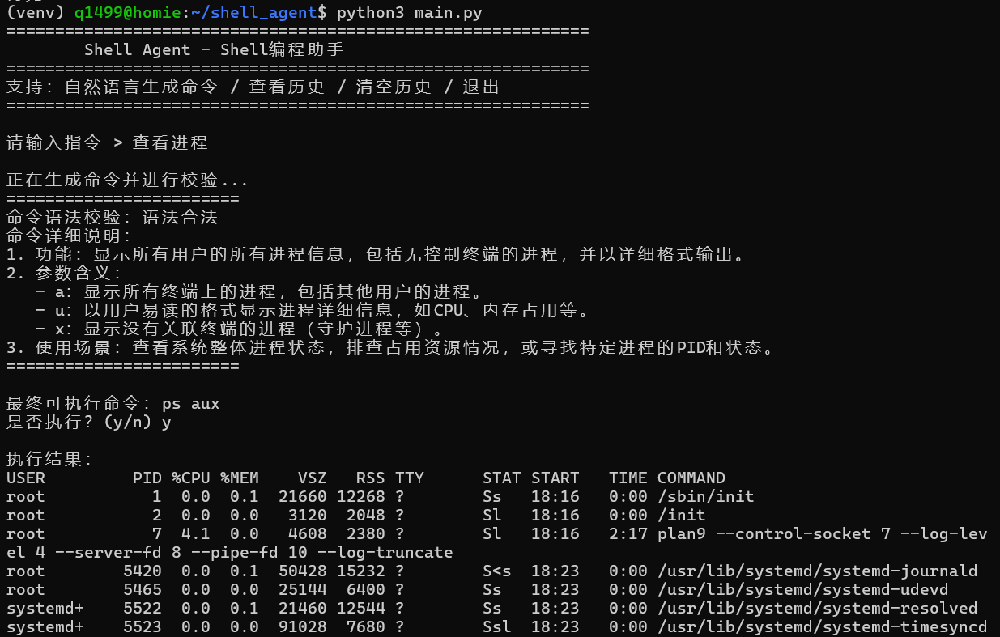
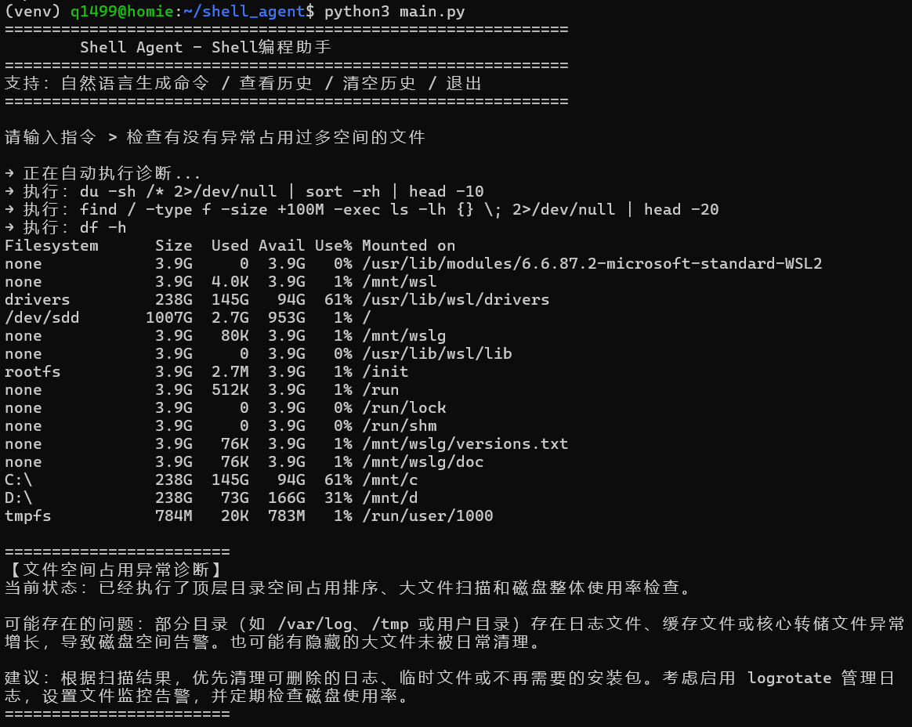
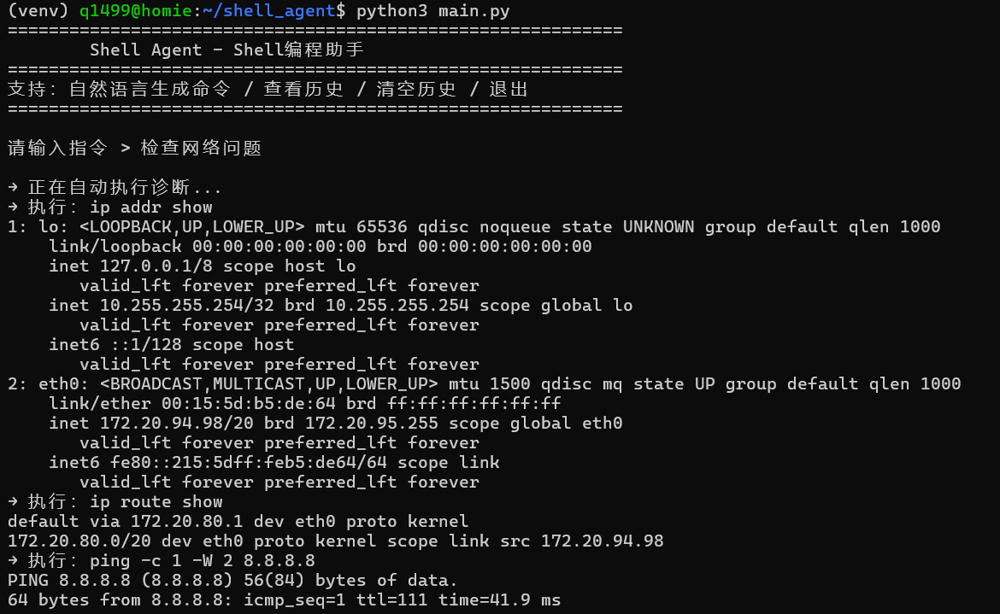
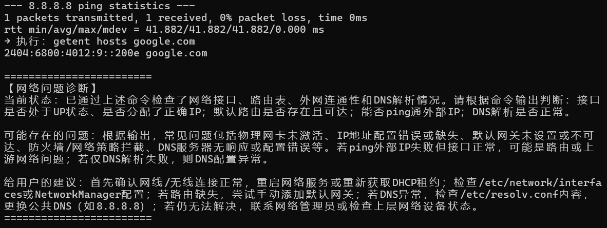

# Shell Agent 智能命令助手

---

## 一、项目介绍

Shell Agent 是一款**基于 DeepSeek 大模型**的 Linux 智能命令助手，支持用户通过**纯自然语言对话**实现命令生成、语法校验、安全执行、历史管理、全自动系统诊断等一体化能力。
无需记忆复杂的 Linux 指令，输入中文即可完成：命令生成 → 语法检查 → 执行 → 分析 → 日志记录 → 诊断报告。

**核心定位**：自然语言 → Linux 命令 → 安全执行 → 系统诊断 → 会话记录 → 自动化分析

---

## 二、项目结构

```
shell_agent/
├── .env                # 大模型 API 配置文件
├── main.py             # 项目主入口
├── requirements.txt    # 依赖包列表
├── config/             # 配置模块
│   └── llm_config.py   # LLM 配置
├── utils/              # 工具模块
│   ├── llm_helper.py   # 大模型调用
│   ├── code_executor.py # 命令执行器
│   ├── extract_code.py # 命令提取
│   ├── session_dir.py  # 会话管理
│   ├── history.py        # 日志、历史记录
│   └── syntax_checker.py # 语法校验
├── prompts.py          # 系统提示词
├── logs/               # 运行日志
├── history/            # 命令历史
└── outputs/            # 会话输出目录
    └── session_xxxx/   # 会话日志 + 诊断记录
```

---

## 三、项目功能

**纯自然语言交互**：无菜单、无数字选择，直接对话式使用  
**DeepSeek 大模型驱动**：智能生成安全、标准的 Bash 命令  
**命令语法校验**：执行前自动检测语法合法性  
**安全命令执行**：带超时、异常捕获、权限安全控制  
**历史记录管理**：查看历史 / 清空历史（自然语言触发）  
**全自动系统诊断**：磁盘、内存、CPU、网络、日志一键诊断  
**统一 Prompt 规范**：无需新增代码，即可扩展任意诊断能力  
**会话隔离记录**：每次运行自动创建独立目录，保存完整操作日志  
**异常容错机制**：API 不可用时自动切换本地备用诊断  
**日志持久化**：系统日志 + 命令历史 + 会话记录全留存

支持自然语言指令示例：

- 查看当前目录文件
- 查看磁盘占用
- 查看进程
- 检查磁盘空间问题
- 检查内存问题
- 检查 CPU 负载
- 查看历史记录
- 清空历史
- 退出

---

## 四、使用流程

### 1. 安装系统依赖（Ubuntu）

```bash
sudo apt update
sudo apt install -y python3 python3-pip python3-venv
```

### 2. 创建并进入项目目录

```bash
mkdir -p ~/shell_agent
cd ~/shell_agent
```

### 3. 创建并激活虚拟环境（推荐）

```bash
python3 -m venv venv
source venv/bin/activate
```

激活成功后，终端前面会显示 `(venv)`

### 4. 安装 Python 依赖

```bash
pip install -r requirements.txt -i https://pypi.tuna.tsinghua.edu.cn/simple
```

### 5. 配置 .env 环境变量

```bash
nano .env
```

写入以下内容（**替换成你的 API Key**）：

```
DEEPSEEK_API_KEY=sk-xxxxxxxxxxxxxxxxxxxxxxxx
DEEPSEEK_BASE_URL=https://api.deepseek.com
DEEPSEEK_MODEL=deepseek-v4-pro
```

保存退出：
`Ctrl + O` → 回车 → `Ctrl + X`

### 6. 启动项目

```bash
python3 main.py
```

---

## 五、使用示例

### 1. 输入自然语言指令——查看磁盘空间



### 2. 输入自然语言指令——查看进程



### 3. 输入自然语言指令——检查磁盘空间问题



### 4. 输入自然语言指令——检查网络问题




### 5. 查看并清空历史记录


---

## 六、退出虚拟环境

```bash
deactivate
```

---
