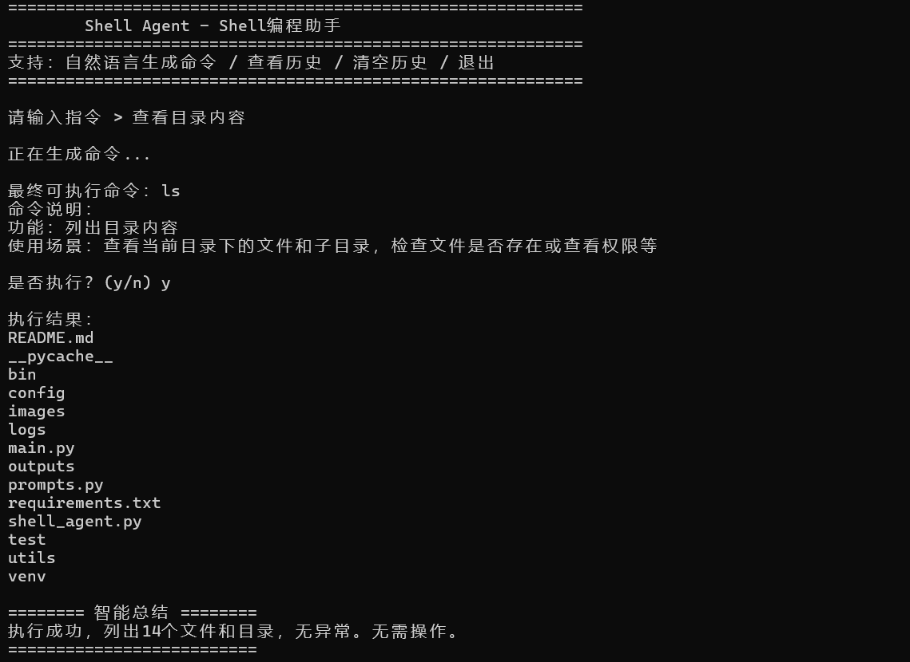
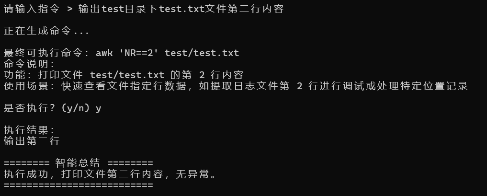
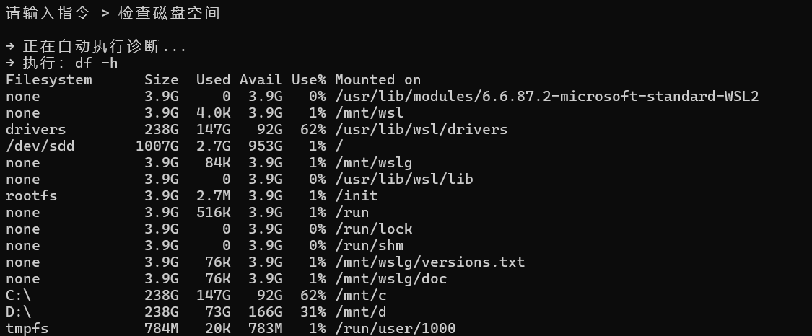
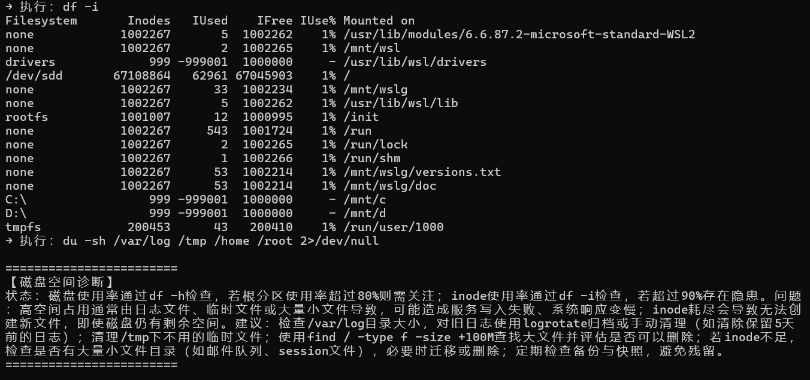
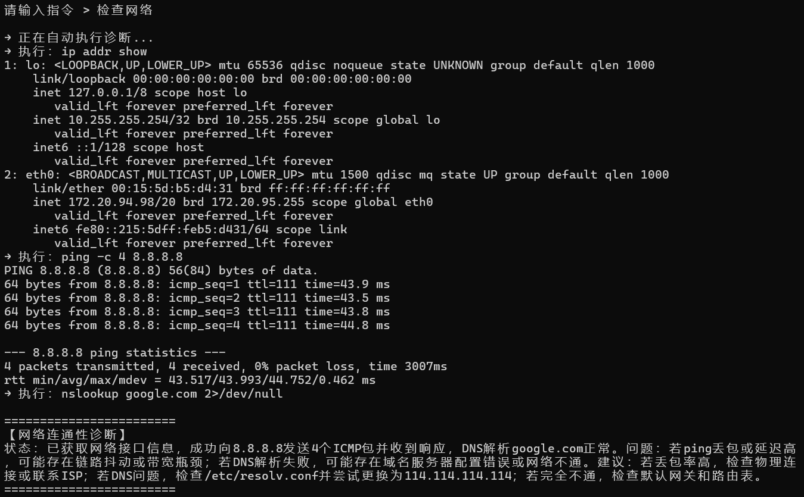
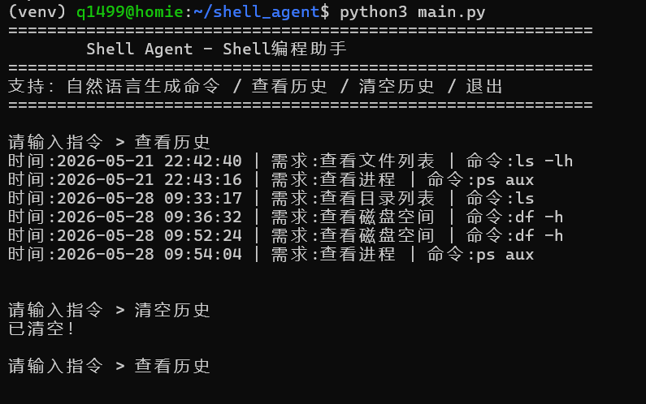

# Shell Agent 智能命令助手

基于 DeepSeek 大模型的 Linux 智能命令助手 | 自然语言交互 | 安全校验 | 自动总结 | 系统诊断

---

## 一、项目介绍

Shell Agent 是一款**基于 DeepSeek 大模型**开发的 Linux 智能命令助手，支持用户通过**纯自然语言对话**实现命令生成、语法校验、风险判断、安全执行、结果自动总结、历史管理、全自动系统诊断等一体化能力。
无需记忆复杂 Linux 指令，输入中文即可完成：
**自然语言输入 → 命令生成 → 语法校验 → 风险判断 → 中文解释 → 安全执行 → 结果自动总结 → 日志/会话记录 → 系统诊断**

**核心定位**：自然语言 → Linux 命令 → 安全校验 → 自动总结 → 系统诊断 → 会话记录 → 自动化分析

---

## 二、项目结构

```
shell_agent/
├── .env                  # 大模型 API 配置文件
├── main.py               # 项目主入口
├── requirements.txt      # 依赖包列表
├── bin/
│   └── start.sh          # 一键激活虚拟环境并启动项目
├── config/               # 配置模块
│   └── llm_config.py     # LLM 相关配置
├── utils/                # 工具模块
│   ├── llm_helper.py     # 大模型调用封装
│   ├── code_executor.py  # Shell 命令安全执行器
│   ├── extract_code.py   # 命令、JSON 内容提取解析
│   ├── session_dir.py    # 独立会话目录管理
│   ├── history.py        # 运行日志、命令历史管理
│   └── syntax_checker.py # 命令语法校验 + 安全风险等级判断
├── prompts.py            # 全局提示词
├── logs/                 # 日志与历史文件存储目录
│   ├── agent.log         # 系统全局运行日志
│   └── cmd_history.txt   # 执行命令历史记录
└── outputs/              # 会话输出根目录
    └── session_xxxx/     # 单次独立会话目录，存放会话日志、诊断记录
```

---

## 三、项目功能

- **纯自然语言交互**：无菜单、无数字选项，全程对话式操作
- **DeepSeek 大模型驱动**：智能生成安全、标准的 Bash 命令
- **命令语法校验**：执行前自动检测语法错误、非法参数（后台静默执行）
- **命令安全风险等级判断**：自动识别 **安全/警告/危险** 三级风险，高危指令直接禁止执行
- **命令中文智能解释**：自动输出功能、参数含义、使用场景
- **执行结果自动总结**：AI 精简总结执行状态、关键数据、异常与建议
- **安全命令执行**：内置超时、异常捕获、权限安全控制
- **历史记录管理**：支持查看历史、一键清空历史，自然语言触发
- **全自动系统诊断**：一键诊断磁盘、内存、CPU、网络、系统日志等问题
- **统一 Prompt 规范**：依靠提示词定义交互格式，新增诊断场景无需改写底层代码
- **会话隔离记录**：每次运行自动生成独立会话目录，完整留存操作轨迹
- **异常容错机制**：大模型 API 不可用时，自动切换本地备用诊断方案

### 支持自然语言指令示例

- 查看当前目录文件
- 查看磁盘占用
- 检查内存问题
- 检查 CPU 负载
- 分析网络状态
- 查看命令历史
- 清空历史记录
- 退出程序

---

## 四、使用流程

### 环境说明

本项目基于 **Ubuntu Linux** 开发运行，需提前安装 Python 相关环境。

### 1. 安装系统依赖（仅首次执行）

```bash
sudo apt update
sudo apt install -y python3 python3-pip python3-venv
```

### 2. 进入项目根目录

```bash
cd ~/shell_agent
```

### 3. 配置大模型密钥（必须配置，仅首次执行）

```bash
nano .env
```

写入以下内容并替换为你的 API Key：

```
DEEPSEEK_API_KEY=sk-xxxxxxxxxxxxxxxxxxxxxxxx
DEEPSEEK_BASE_URL=https://api.deepseek.com
DEEPSEEK_MODEL=deepseek-v4-pro
```

保存退出：`Ctrl + O` → 回车 → `Ctrl + X`

### 4. 项目启动方式

#### 方式一：一键启动（推荐）

① 赋予执行权限（仅第一次）

```bash
chmod +x bin/start.sh
```

② 启动项目

```bash
./bin/start.sh
```

#### 方式二：手动启动

① 创建并激活虚拟环境

```bash
python3 -m venv venv
source venv/bin/activate
```

② 安装依赖

```bash
pip install -r requirements.txt -i https://pypi.tuna.tsinghua.edu.cn/simple
```

③ 运行

```bash
python3 main.py
```

### 5. 退出程序

在交互界面输入：`退出`
如需退出虚拟环境：

```bash
deactivate
```

---

## 五、使用示例

### 1. 查看目录内容



### 2. 文本处理



### 3. 检查磁盘空间




### 4. 检查网络



### 5. 查看并清空历史记录



---

## 六、常见问题说明

1. **提示权限不足**
   执行 `chmod +x bin/start.sh`，仅需一次。

2. **依赖安装失败**
   执行 `pip install --upgrade pip` 后重试。

3. **大模型调用报错**
   检查 `.env` 中 API Key、URL、模型名是否正确。

4. **找不到配置/日志文件**
   确保在项目根目录 `shell_agent` 下执行命令。

---
